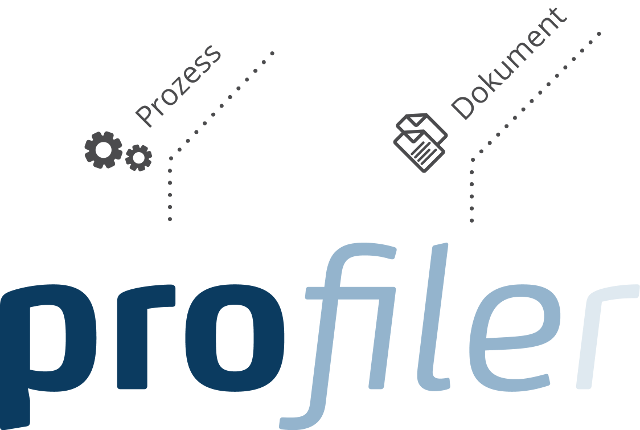

= DocumentPatternAnalyser
Thomas W. Stütz
1.0, 2020-08-22
ifndef::sourcedir[:sourcedir: ../src/main/java]
ifndef::imagesdir[:imagesdir: images]
ifndef::backend[:backend: html5]
:icons: font

== Team

* Gahleitner Lorenz
* Hosic Tarik

== Auftraggeber

* Kontron Technologies
* Tochterunternehmen der S&T AG
* Vier Standorte in Österreich
* Entwicklung von Standardlösungen und Individualsoftware

== Ausgangslage

* Dokumentenmanagementsystem: Profiler
* Organisation der Dokumente anhand der Vorlagen erfolgt manuell

== Ziele

* Zuweisen der Vorlagen and das Dokument soll automatisiert werden
* Vergleich und eventuelle Findung einer anderen, besseren PDF-Library

== Ergebnis

* ASP.NET Core Anwendung
** Als Windows-Service im Hintergrund
** Library für das Arbeiten mit PDFs und Bilddateien
* Vergleich mit anderen Libraries für das Arbeiten mit PDFs und Bilddateien

== Live-Demo

== Systemarchitektur & Ablauf

=== Systemarchitektur

=== Ablauf

== Neuerlernte Technologien

* SOAP-Services
* Arbeiten mit Firmentools
* Arbeiten mit PDFs und Bilddateien und dessen Inhalten

== Probleme

* Pdf als Bildinhalt
* Zusammenfügen von Konstrukten
* Konvertierung von Pdf zu Tiff
* Qualität der Bildkonvertierung

== Danke für Ihre Aufmerksamkeit